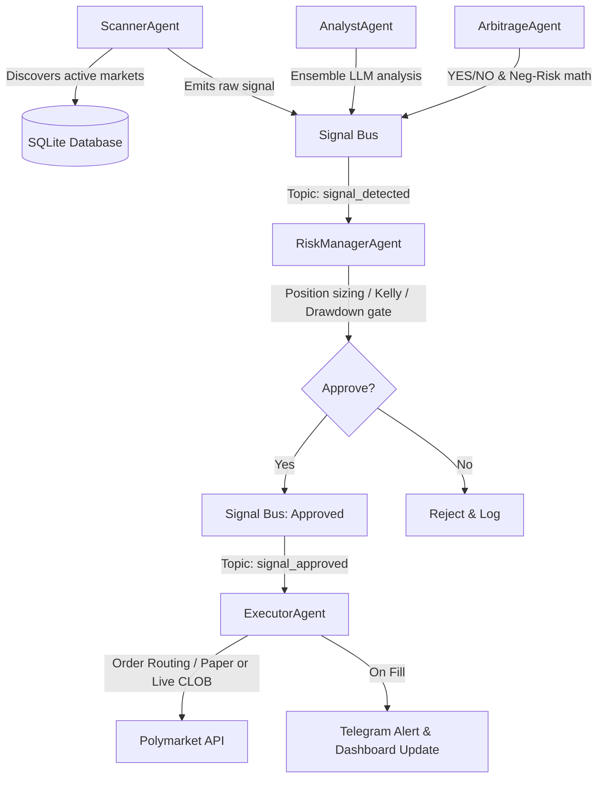

# PolyAgent — Polymarket Autonomous Multi-Agent Trading Backend

PolyAgent is an autonomous, quantitative trading backend for Polymarket prediction markets. It implements multi-agent architectures and arbitrage strategies detailed in prediction market research, running 24/7 on a VPS with a premium real-time HTML5 dashboard.

## 🚀 Key Features

- **Multi-Agent Architecture**:
  - **ScannerAgent**: Discovers active markets on Polymarket Gamma API, indexes order books, and aggregates metrics.
  - **AnalystAgent**: Uses a **PolySwarm-style LLM ensemble** (5 distinct analyst personas: Economist, Statistician, Contrarian, News Analyst, Bayesian) to query OpenAI/Gemini in parallel, aggregate probabilities, and compute KL-divergence-based edge.
  - **ArbitrageAgent**: Specialized math engine that monitors prices and detects risk-free trade opportunities.
  - **RiskManagerAgent**: Enforces capital preservation. Uses fractional Kelly Criterion (25% cap) for sizing, tracks drawdowns, and pauses trading if limits are breached.
  - **ExecutorAgent**: Submits GTC (maker, 0% fees) and FOK (taker) orders on Polymarket CLOB via `py-clob-client`, monitors fills, and alerts on Telegram.
- **Advanced Strategies**:
  - **YES/NO Internal Arbitrage**: Exploits complement violations (YES + NO < 1.0) minus taker fees (1.8%).
  - **Negative-Risk Arbitrage**: Exploits multi-outcome markets where sum(YES) > 1.0 + fees by buying NO on all outcomes.
  - **Statistical Edge**: Trades value when LLM ensemble predictions deviate significantly from market prices.
- **Premium Live Terminal**: Real-time glassmorphism HTML5 SPA dashboard connected via WebSockets for live feeds, performance growth charts, open positions, and manual pause controls.

---

## 🛠️ Quick Start

### 1. Configure Environment Variables
Copy the template file to `.env` and fill in your keys:
```bash
cp .env.example .env
```
*For paper-trading, you do not need Polymarket credentials (a default balance of $10,000 USDC is simulated).*

### 2. Run with Docker (Recommended)
Launch the containerized application. The SQLite database will be persisted in `./data/`:
```bash
docker-compose up --build -d
```
Access the Dashboard Terminal at:
👉 **[http://localhost:8000/dashboard/](http://localhost:8000/dashboard/)**

### 3. Run Locally (Development)
Create a Python 3.12+ virtual environment, install the package, and start the FastAPI server:
```bash
python -m venv venv
source venv/bin/activate  # On Windows: venv\Scripts\activate
pip install -e .
python -m polyagent.main
```

---

## ⚙️ Configuration Options

| Variable | Default | Description |
|---|---|---|
| `MODE` | `paper` | Execution mode: `paper` or `live` |
| `PAPER_BALANCE` | `10000` | Starting paper balance in USDC |
| `MAX_POSITION_SIZE_USD` | `50` | Maximum capital allocated to a single leg |
| `MAX_TOTAL_EXPOSURE_USD`| `500` | Maximum aggregate exposure across all open positions |
| `MAX_DRAWDOWN_PCT` | `15` | Percentage of drawdown before auto-pausing system |
| `MIN_EDGE_PCT` | `2` | Minimum mathematical edge (2%) required to trigger trade |
| `LLM_PROVIDER` | `openai` | LLM backend: `openai` or `gemini` |
| `LLM_API_KEY` | - | API key for the selected LLM provider |
| `TELEGRAM_BOT_TOKEN` | - | Bot token for Telegram alerts (optional) |
| `TELEGRAM_CHAT_ID` | - | Chat/Channel ID for Telegram alerts (optional) |
| `SCAN_INTERVAL_SECONDS` | `30` | Interval in seconds between scanner sweeps |
| `TARGET_CATEGORIES` | `all` | Comma-separated list of categories to scan (e.g., `politics,crypto`) |
| `DATABASE_URL` | `sqlite+aiosqlite:///data/polyagent.db` | Async SQLAlchemy database URL |

---

## 📈 System Workflow


